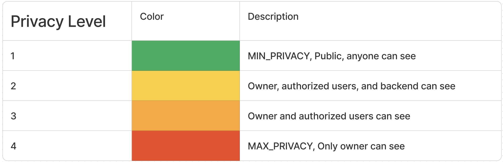
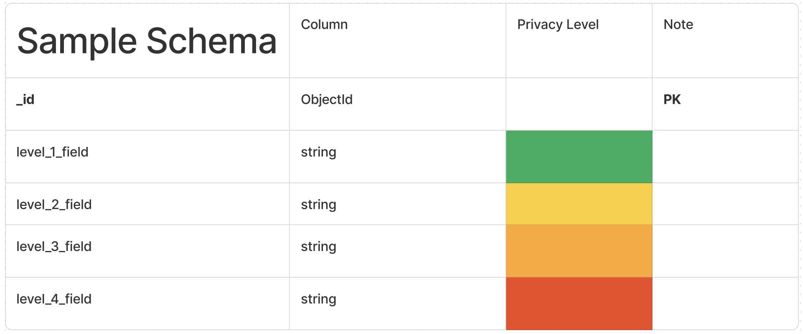

# End-to-End Encryption (E2EE) API Model

  <!--  -->
  
  <!--  -->
  
  
  <!--  -->

This repository presents an end-to-end encryption (E2EE) API model where users have ownership of their data, and only authorized parties can access it. In this model, each user possesses their own key pair in a public-key system, which is utilized for encrypting, decrypting data, generating and verifying signatures, as well as data transmission/communication. The key can be managed either by the user themselves or by a no-trust/semi-trust distributed/multi-party key service provider. The project is written in Express framework for simple and fast demonstration.

## Disclaimer:
Please note that this repository is intended for demonstration purposes only and is not yet suitable for production use. Use of this code in live environments may result in unintended consequences or vulnerabilities.

## Explain the model:
- Data is field-encrypted by the user before being sent to the backend and decrypted when fetched back on the frontend.
- There are 4 different levels of privacy for each data:

- Developer can customize encryption strategies using flexible transformation pipeline in the FE side
- This is a sample schema where we can set different privacy levels for different fields

## How to Run:
- If you haven't installed the `bun` package manager, run `npx install-bun`.
- Run `bun install` to install Node packages.
- Create an **.env** file (clone from **.env.example**) and fill your JWT & MONGO secrets
- Run `bun run teste2ee` for a full CRUD demo of user profile APIs with E2EE

## Roadmap:
1. Full Demo for E2EE APIs & Privacy-Access-Control Models
2. Analyze & Enhance Cryptography Protocols/Methods Used in the Model
3. Multi-Party Key Infrastructure Integration Framework
4. Guidelines on Combining Various Latest Industry-Applicable Strategies for Protecting Privacy
5. Lightweight Proof of Integrity for Encrypted Message
6. Privacy AI
7. Full Privacy Framework

## Collaboration:
If you're a cryptographer, researcher, engineer, or anyone interested, feel free to reach out to me for collaboration at galin.chung.nguyen@gmail.com or create a PR into this repository. All contributions are welcome!

Let's work towards "Privacy by Default", as it's a basic right for all of us.